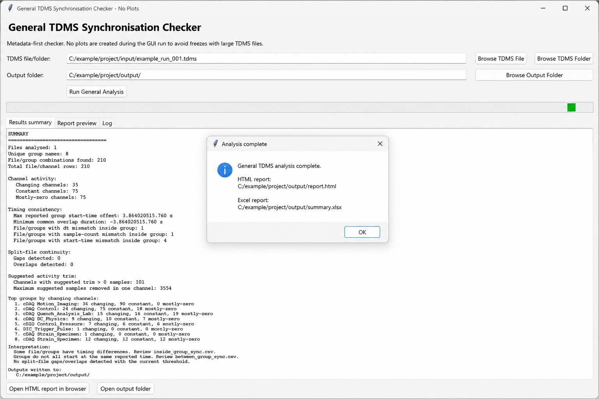
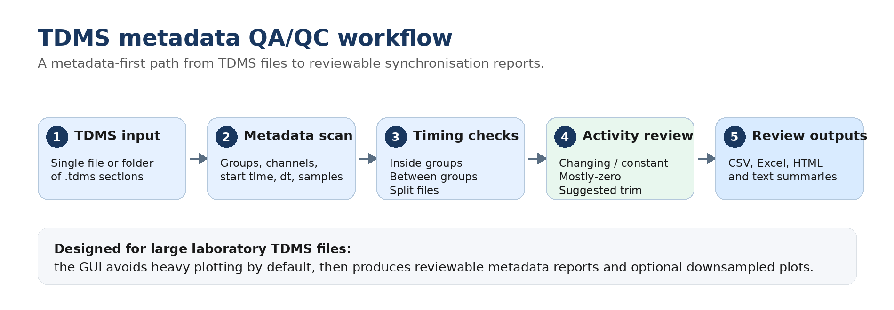
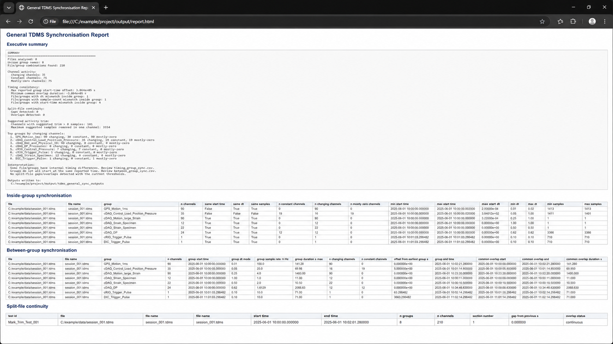

# TDMS Sync Checker

[](pyproject.toml)
[](LICENSE)


A **metadata-first Python tool** for checking TDMS file structure, timing metadata, group/channel synchronisation, split-file continuity, inactive channels, and suggested activity trimming.

It is designed for exploratory laboratory TDMS quality control where large files can make full plotting slow or unstable. The main GUI therefore focuses on metadata checks and reviewable reports; plotting is available as a separate optional step.

<p align="center">
  
</p>

<p align="center">
  <em>GUI workflow after a completed metadata-first TDMS synchronisation check. Example paths and data shown in this screenshot are anonymised.</em>
</p>

> **Status:** prototype / v0.1.0  
> Results should be reviewed by the user before they are used for engineering decisions.

---

## What this repository provides

TDMS files from laboratory systems can contain different groups, channels, timestamps, sampling rates, sample counts, split-file sections, inactive channels, and start-up/buffer samples. This tool does **not** assume fixed channel names. It scans whatever is present and creates general QA/QC reports.

The repository provides:

- a desktop GUI for selecting one TDMS file or a folder of TDMS files;
- a command-line interface for repeatable checks;
- inside-group and between-group synchronisation checks;
- split-file continuity checks for folder-based acquisitions;
- channel activity summaries for changing, constant, and mostly-zero channels;
- suggested activity-trim estimates for review;
- CSV, Excel, HTML, and plain-text report outputs;
- optional downsampled plotting in a separate script to avoid GUI freezes with large TDMS files.

---

## Workflow overview

<p align="center">
  
</p>

The core workflow is:

```text
TDMS file or folder
→ metadata scan across groups/channels
→ inside-group synchronisation checks
→ between-group timing checks
→ split-file continuity checks
→ activity/trim summary
→ CSV, Excel, HTML, and text outputs
```

---

## Quick start

### 1. Install

Create and activate a virtual environment if possible, then install the package:

```bash
pip install -e .
```

For development and tests:

```bash
pip install -e ".[dev]"
```

### 2. Run the GUI

```bash
python tdms_sync_checker_gui.py
```

Or, after installation:

```bash
tdms-sync-checker-gui
```

### 3. Run from the command line

Single TDMS file:

```bash
tdms-sync-checker --input "C:/path/to/file.tdms" --output "C:/path/to/output"
```

Folder of TDMS files:

```bash
tdms-sync-checker --input "C:/path/to/folder" --output "C:/path/to/output"
```

### 4. Run from Spyder

Open and run:

```text
scripts/tdms_sync_checker_single_file_spyder.py
```

The GUI will open. After analysis, use the **Report preview** tab to review the main summary inside the GUI, or click **Open HTML report in browser** for the full report.

---

## Example HTML report

<p align="center">
  
</p>

<p align="center">
  <em>Generated HTML report with executive summary, inside-group checks, between-group synchronisation, and split-file continuity tables. Example paths and file names are anonymised.</em>
</p>

---

## Outputs

The output folder contains machine-readable tables and human-readable summaries:

```text
csv/
├── channel_metadata_all_channels.csv
├── inside_group_sync.csv
├── between_group_sync.csv
├── split_file_continuity.csv
└── suggested_activity_trim.csv

summary.xlsx
summary.txt
report.html
```

| Output | Purpose |
|---|---|
| `channel_metadata_all_channels.csv` | Full channel-level metadata table |
| `inside_group_sync.csv` | Per-file/per-group checks for start time, `dt`, and sample-count consistency |
| `between_group_sync.csv` | Group-level timing offsets, durations, and common-overlap estimates |
| `split_file_continuity.csv` | Gap/overlap checks for multi-file acquisitions |
| `suggested_activity_trim.csv` | Generic suggested start/end trimming estimates |
| `summary.xlsx` | Spreadsheet version of the report tables |
| `summary.txt` | Plain-text executive summary |
| `report.html` | Browser-readable report |

---

## Method summary

### Inside-group synchronisation

For each file/group combination, the tool checks whether all channels have:

- the same reported start time;
- the same reported `dt`;
- the same sample count.

### Between-group synchronisation

For each group, the tool estimates:

- group start time;
- group duration;
- group end time;
- offset from the earliest group;
- common overlap duration.

### Split-file continuity

For folders containing multiple `.tdms` files, the tool sorts sections by reported start time and checks for:

- continuous sections;
- gaps;
- overlaps.

### Activity trimming

The suggested activity trim is a **generic estimate**. It does not assume that zero values are invalid, because zero can be a valid operating state.

---

## Optional plotting

Plotting is intentionally separated from the main GUI to avoid freezing with large TDMS files.

After the main report works, edit and run:

```text
scripts/optional_tdms_plot_maker.py
```

Set the output folder in the script:

```python
OUTPUT_FOLDER = Path(r"C:\Your\Folder\Here\tdms_general_sync_outputs")
```

Then run it. It creates downsampled plots in:

```text
optional_plots/
```

---

## Limitations

- This is a metadata-first QA/QC tool, not a fully validated automatic synchronisation algorithm.
- TDMS metadata can be wrong, incomplete, or inconsistent with the actual sensor data.
- Suggested trimming is heuristic and must be reviewed.
- Plotting is optional and separate because large TDMS files can overload Matplotlib/Tkinter.
- The tool does not replace engineering judgement.

---

## Repository structure

```text
tdms-sync-checker/
├── src/tdms_sync_checker/
│   ├── __init__.py
│   ├── core.py
│   ├── gui.py
│   ├── cli.py
│   └── __main__.py
├── scripts/
│   ├── optional_tdms_plot_maker.py
│   └── tdms_sync_checker_single_file_spyder.py
├── docs/
│   ├── assets/
│   │   ├── readme_gui_analysis_complete.png
│   │   ├── readme_html_report_overview.png
│   │   └── readme_workflow.png
│   ├── method_notes.md
│   └── github_release_notes_v0.1.0.md
├── examples/
│   └── sample_output_description.md
├── tests/
├── tdms_sync_checker_gui.py
├── pyproject.toml
├── requirements.txt
├── README.md
├── LICENSE
└── .gitignore
```

---

## Citation / acknowledgement

This project was developed as part of a laboratory workflow for TDMS data-quality checking and synchronisation review.

---

## License

See [`LICENSE`](LICENSE).
